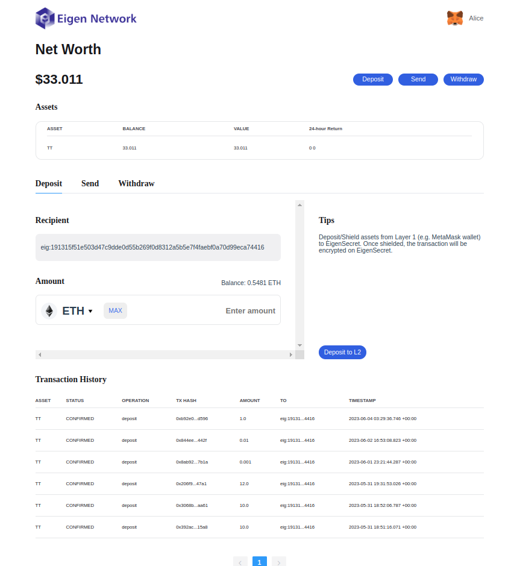

# Private Transaction

**NOTE**: The test network has only been deployed on [Mumbai](https://mumbai.polygonscan.com/), so make sure you have some MATIC from Mumbai Testnet before registration.

All the contracts of Eigen Secret on Mumbai Testnet can be found [here](https://raw.githubusercontent.com/0xEigenLabs/eigen-secret/zkpay_dev/.contract.json).

## Quick start

Join our [TG](https://web.telegram.org/k/#@Eigen_Network) and get the Test ERC20 Token before shielding your transaction.

Starting your first private transaction with test MATIC via Eigen Secret is easy.

1. Visit [https://secret.eigen.cash](https://secret.eigen.cash/), and just `sign-up` by your Metamask;

2. `deposit` test MATIC to Eigen Secret L2;

3. send to L2, or wthdraw the token back to L1 as your will. Notice that the first deposit will be super slow since we need to download the SRS files.

